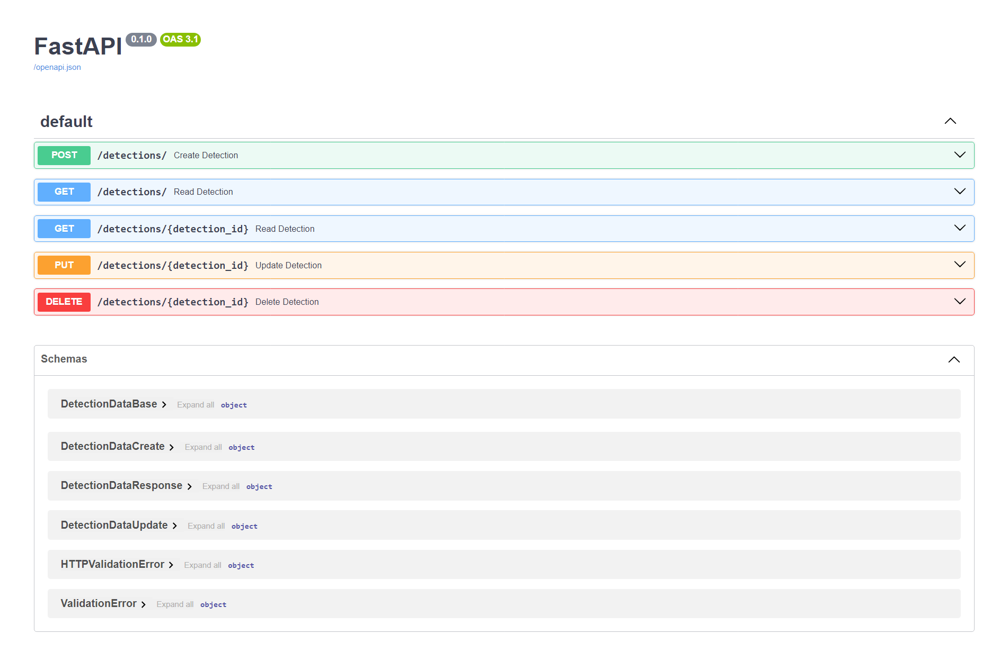
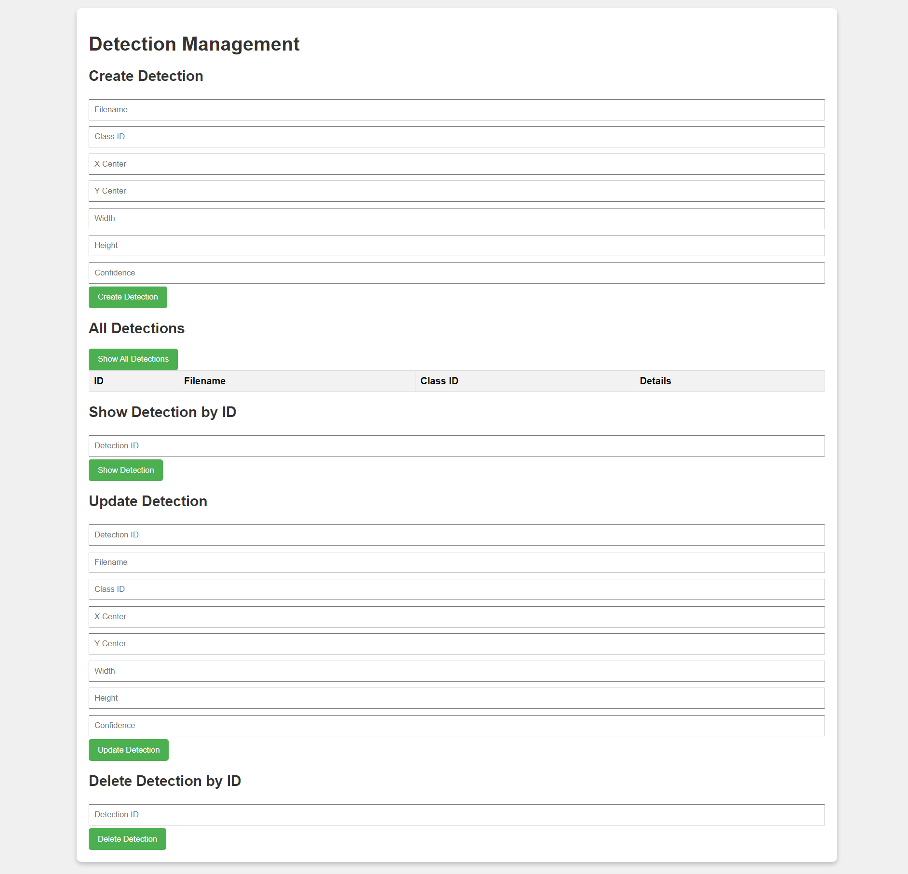
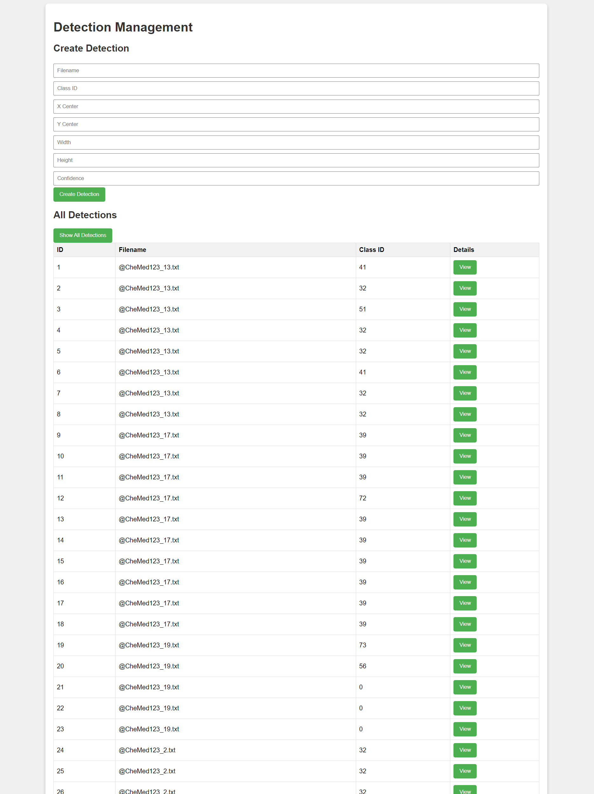

# 🧑‍⚕️ Telegram-Ethiopian-Medical-channel-data-warehouse

## Table of Contents

- [Overview](#overview)
- [Technologies](#technologies)
- [Folder Organization](#folder-organization)
- [Setup](#setup)
- [Notes](#notes)
- [Contributing](#contributing)
- [License](#license)

## Overview: Key Functionalities


## 1. Project Overview
In this project, I developed a medical data pipeline by scraping data from a Telegram channel using Telethon and storing it in a PostgreSQL database. I also extracted images from the channel and applied YOLO for object detection to generate labels. Following an ETL process, the labeled data was stored in a vector database. Finally, I implemented CRUD operations using FastAPI and built a frontend to facilitate user interaction with the data.

## 2. Data Scraping Functionality
- **Utilized Telethon to scrape medical data from a Telegram channel.**
- **Stored the scraped data in a PostgreSQL database**
- **Extracted additional information from the channel for enhanced data quality.**

## 3. Object Detection
- **Implemented YOLO (You Only Look Once) for object detection in the collected medical images.**
- **Preprocessed images to prepare them for analysis**
- **Labeled identified objects within images, facilitating better data interpretation and insights** 
## 4. FastAPI Endpoint
- **Developed a FastAPI application to create, read, update, and delete (CRUD) medical data entries**
- **Enabled seamless interaction with the PostgreSQL database for managing the scraped data and object detection results.**


## 6. Frontend Development
- **Created a user-friendly frontend interface for interacting with the FastAPI backend.**
- **Allowed users to visualize scraped data, view object detection results, and manage entries through a simple and intuitive interface.**



## 7. Conclusion
**This project effectively demonstrates the integration of various technologies to create a comprehensive medical data processing system. By leveraging Telethon for data scraping, we were able to gather valuable insights from a Telegram channel and store them in a PostgreSQL database. The implementation of YOLO for object detection enhanced the analysis of medical images, providing valuable labels for further interpretation. With the FastAPI endpoint, we ensured efficient data management through CRUD operations, and the user-friendly frontend facilitated seamless interaction with the application. Overall, this project highlights the synergy between data scraping, machine learning, and web development, showcasing a robust solution for medical data analysis and visualization.**


# Tools & Libraries Used

1. **Programming Language**: [](https://www.python.org/)
2. **Data Manipulation**: [](https://pandas.pydata.org/)
3. **Numerical Computing**: [](https://numpy.org/)
4. **Data Visualization**: [](https://matplotlib.org/) [](https://seaborn.pydata.org/)
5. **Logging**: [](https://docs.python.org/3/howto/logging.html)
6.**Data Scraping**: [](https://github.com/LonamiWebs/Telethon)

7. **Database**: [](https://www.postgresql.org/)

8. **Object Detection**: [](https://github.com/AlexeyAB/darknet)

9. **Web Framework**: [](https://fastapi.tiangolo.com/)

10. **Frontend**: [](https://developer.mozilla.org/en-US/docs/Web/JavaScript)


11. **Statistical Analysis**: [](https://scipy.org/)

12. **Version Control**: [](https://git-scm.com/)
13. **Code Formatting & Linting**: [](https://github.com/psf/black)
14. **Continuous Integration (CI)**: [](https://github.com/features/actions)
## Folder Organization

```

📁.github
└──
    └── 📁workflows
         └── 📃unittests.yml
└── 📁frontend
         └── 📃index.html
         └── 📃styles.css
         └── 📃script.js
└── 📁myproject
         └── 📁analysis
         └── 📁logs
         └── 📁macros
         └── 📁models
         └── 📁seeds
         └── 📁snapshots
         └── 📁target
         └── 📁tests
         └── 📜.gitignore
         └── 📃dbt_project.yml


└── 📁notebooks
         └── 📓dataCleaningAndTransforming.ipynb
         └── 📓processing_and_storing_YOL_data_into_db.ipynb
└── 📁photos
         └── 📁YOLO
         └── photos
└── 📁scripts
         └── 📁YOLO
                  └── 📃making_data_frame_the_detected_data.py
                  └── 📃store_to_db.py
         └── 📃__init__.py
         └── 📃data_cleaning_and_transformation.py
         └── 📃db_setup.py
         └── 📃scraping_photos.py
         └── 📃telegram_data_scraper.py
└── 💻src
    └── 📁dashboard-div
                    └── 📝app.py
                    └── 📝crud.py
                    └── 📝database.py
                    └── 📝model.py
                    └── 📝schenas.py
└── 📁tg_channels
        └── 📃channels.json
        └── 📃YOLOchannels.json
└── 📁yoloyv5
└── ⌛tests
         └── 📃__init__.py

└── 📜.gitignore
└── 📰README.md
└── 🔋requirements.txt
└── 📇templates.py

```


### **Usage**

These modules are designed to be used in conjunction with each other to streamline the data analysis process, from data preparation and cleaning to in-depth analysis and model creation.

- **💻src**: The main source code of the project, including the Streamlit dashboard and other related files.

  - **📁dashboard-div**: Holds the code for the dashboard.
    - **📝app.py**: Main application file for the dashboard.
    - **📝README.md**: Documentation specific to the dashboard component.

- **⌛tests**: Contains test files, including unit and integration tests.

  - \***\*init**.py\*\*: Initialization file for the test module.

- **📜.gitignore**: Specifies files and directories to be ignored by Git.

- **📰README.md**: The main documentation for the entire project.

- **🔋requirements.txt**: Lists the Python dependencies required to run the project.

- **📇templates.py**: Contains templates used within the project, possibly for generating or processing data.

## Setup

1. Clone the repo

```bash
git clone https://github.com/Bereket-07/Telegram-Ethiopian-Medical-channel-data-warehouse-.git
```

2. Change directory

```bash
cd Telegram-Ethiopian-Medical-channel-data-warehouse-
```

3. Install all dependencies

```bash
pip install -r requirements.txt
```

4. change directory to run the Flask app locally.

```bash
cd src
```

5. Start the Flask app

```bash
uvicorn dashboard-div.app:app --reload                           
```
6. go to the front end then run the html

## Contributing

We welcome contributions to this project! To get started, please follow these guidelines:

### How to Contribute

1. **Fork the repository**: Click the "Fork" button at the top right of this page to create your own copy of the repository.
2. **Clone your fork**: Clone the forked repository to your local machine.
   ```bash
   git clone https://github.com/your-username/your-repository.git
   ```
3. **Create a new branch**: Create a new branch for your feature or bugfix.
   ```bash
   git checkout -b feature/your-feature
   ```
4. **Make your changes**: Implement your feature or fix the bug. Ensure your code adheres to the project's coding standards and style.
5. **Commit your changes**: Commit your changes with a descriptive message.
   ```bash
   git add .
   git commit -m 'Add new feature or fix bug'
   ```
6. **Push your branch**: Push your branch to your forked repository.
   ```bash
   git push origin feature/your-feature
   ```
7. **Create a Pull Request**: Go to the repository on GitHub, switch to your branch, and click the `New Pull Request` button. Provide a detailed description of your changes and submit the pull request.

## Additional Information

- **Bug Reports**: If you find a bug, please open an issue in the repository with details about the problem.

- **Feature Requests**: If you have ideas for new features, feel free to open an issue or submit a pull request.

## License

This project is licensed under the MIT License

### Summary

The MIT License is a permissive free software license originating at the Massachusetts Institute of Technology (MIT). It is a simple and easy-to-understand license that places very few restrictions on reuse, making it a popular choice for open source projects.

By using this project, you agree to include the original copyright notice and permission notice in any copies or substantial portions of the software.
